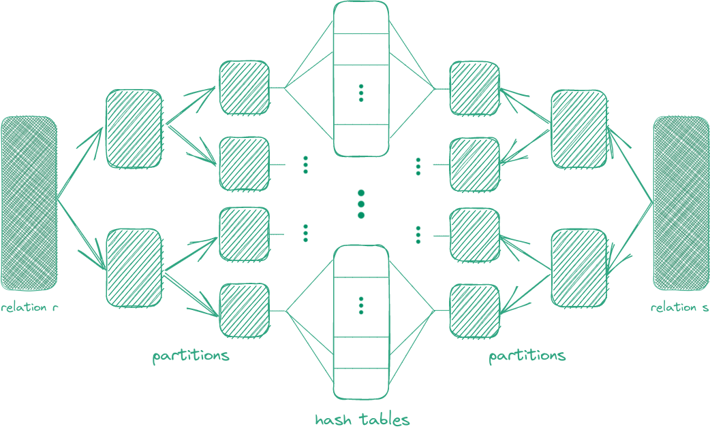
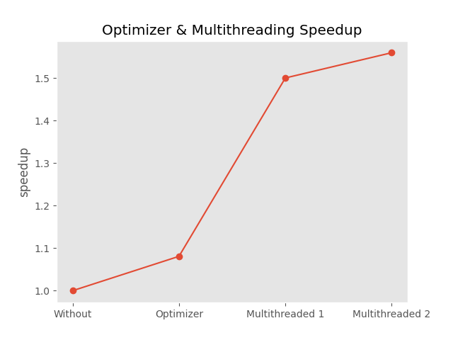

# Partitioned Hash Join

This repository contains a multi-threaded implementation of the partitioned hash join algorithm, specifically designed for a columnar database, written in C. In light of advancements in modern computer hardware, our objective is to create a subset of a database that efficiently manages data entirely in memory.

To ensure robustness, a comprehensive test suite is provided, and the performance is evaluated against the harness used in the SIGMOD 2018 Programming Contest. This was a team project completed in collaboration with [Yiannis Zervakis](https://github.com/johnzerv/) and [George Sittas](https://github.com/GeorgeSittas/).

## Implementation

### Partitioned Hash Join



The partitioned hash join algorithm is based on the paper Main-memory hash joins on multi-core CPUs[^1]. The idea is to divide the data from two relations into buckets, so that the largest bucket can fit in the L2 cache of the processor. To ensure this, we assume a maximum of two passes will be required, depending on the number of bits used as partitioning radices.

The buckets are created by applying the same hash function to the data of both relations. Each partition is then independently processed and joined with the corresponding partition from the other dataset. This approach is commonly used in parallel processing environments to distribute the workload across multiple computing nodes.

### Hopscotch Hashing

To achieve locality properties in the hash table, we used the Hopscotch hashing scheme, which combines open addressing and separate chaining. Our implementation followed the principles outlined in the paper Hopscotch Hashing[^2], with some necessary adjustments to account for duplicate values.


For the trivial case, we utilize the bitmap to determine the location within a non-full neighborhood. Otherwise, we attempt to merge the duplicate payloads into a single bucket. When merging is not possible, we initiate a rehash operation on the table and restart the insertion process.

To hash the 64-bit unsigned integers we employed the "ranhash" function from the book Numerical Recipes[^3]. It's a relatively fast, non-cryptographic hash function, which passes tests for randomness.


### Queries

The relations are initially mapped into the main memory. Subsequently, each query in the stream is parsed and assigned on a heap-allocated object that represents it. We chose to separate filter and join predicates as distinct entities, so that filters are applied first. 

To enhance performance, we halt predicate evaluation, if an empty result is obtained at any point. This saves time since the subsequent projections would also be empty. In cases where both relations are present in the intermediate results, a filter operation is applied instead of join, to streamline the process.


### Optimizer

Statistics are collected after loading each relation. To obtain the count of distinct values, we opted to sort the table and count the unique adjacent values, with $O(n\log{n})$ complexity. This approach proved a suitable middle ground between the naive approach with $O(n^2)$ complexity and the hashtable approach that has $O(n)$ complexity, but requires a significant amount of memory. 

For Join Enumeration, we followed the algorithm from Building Query Compilers[^4], generating all possible permutations and retaining only left-deep join trees without cross products. This reduces the number of permutations from $n!$ to $(n-1)!$.

Another optimization involved utilizing a transformer layer to bypass unnecessary cost calculations, such as in single-join queries. Additionally, the applying filters function sets a flag if a result is empty, enabling us to position the optimizer after the filters are applied and skip it when not needed.

### Multithreading

The implementation leverages batch-level concurrency, allowing multiple queries to be executed simultaneously. Additionally, a job scheduler has been implemented to accelerate the join algorithm by separating the tasks of histogram creation, index building, and index probing, into independent jobs. Incorporating multithreading on the batch-level offered significant performance improvements. Join-level parallelization also contributed to speed-ups, albeit on a smaller scale.

## Benchmarks

In this section, the benchmarks we present were executed multiple times against SIGMOD's test harness, and the recorded measurements were averaged.

#### Optimizer

| Average time in seconds | Speedup of Optimizers | 
|---|---|
| | |

| Without Optimizer |  Simple Optimizer | Dynamic Greedy  |  Dynamic Transform |
|---|---|---|---|
| 09:30.801  | 09:23.830  | 08:52.816  |  08:48.118 |

The dynamic algorithm outperformed the simple optimizer, achieving an average time that was forty seconds faster. By incorporating the transformer, we further reduced the execution time by a few more seconds. Therefore, even before incorporating multithreading, the optimizer achieved a significant speedup.

#### Multithreading & Optimizer

| Average time in seconds | Speedup | 
|---|---|
| | |

| Without | Optimizer | Optimizer & Multithreaded 1  |  Optimizer & Multithreaded 2 |
|---|---|---|---|
| 09:30.801  | 08:48.118 | 06:20.456  |  06:05.964 |

By parallelizing the queries, we achieved an average time reduction of two and a half minutes. Furthermore, with the addition of the scheduler and PHJoin jobs, the average time decreased to only six minutes. Overall, the combination of optimizer and multithreading enhancements resulted in a speedup of over 50%.

### Parameter Tuning

Additional experiments were conducted to fine-tune the parameters, resulting in an execution time of less than five minutes. However, it is important to note that these parameter settings are specific to our CPU, and should be adjusted accordingly for a machine with different number of cores and architecture.

#### Neighbourhood Size

| Average time in seconds | Speedup | 
|---|---|
| | |

| Neighbourhood size: 24 | Neighbourhood size: 32 |  Neighbourhood size: 48 |
|---|---|---|
| 17:06.088 | 05:32.184 | 05:03.751 |

Chaining resolved the problem of duplicate values, allowing for experimentation with the neighborhood size. We found that a neighborhood size of 48 yielded the best performance, averaging around five minutes.

#### Number of Bits

The number of bits used for the partition hashing proved to be a highly sensitive parameter. The best average time was achieved by setting the number of bits to 8 for the first pass and 10 for the second pass. Different cache and block sizes may result in a different optimal range for these parameters though.

#### Thread Size

| Average time in seconds | Speedup | 
|---|---|
| | |

| Single-threaded | 8 - 2 Threads  | 2 - 5 Threads  |  3 - 4 Threads |  3 - 3 Threads |
|---|---|---|---|---|
| 08:48.118  | 05:45.164  |  05:09.822 |  05:01.953 | 04:58.047  |

We investigated the thread size, taking into account the cache size and number of CPU cores. In the table, the first number represents the count of query threads, while the second corresponds to the join threads. We found that the optimal configuration is to have three threads for each thread pool. 

### Computer Systems

The benchmarks were conducted on an M1 Pro with ten cores and a 16GB unified memory. The L1 cache size is 128KB, and the L2 is 24MB for the performance cores and 64KB for the efficiency cores. The L2 cache is shared, and the cache line is 128 bytes long.


## Compilation & Execution

To compile all necessary files, execute the following command:

```bash
make
```

To run all tests first, followed by SIGMOD's test harness:

```bash
make run
```

To run everything in valgrind for memory debugging:

```bash
make valgrind
```

To lint all source files and run all tests:

```bash
make prepare
```

To clean up files and remove object files:

```bash
make clean
```

##### Requirements

The project uses gcc and clang-format, adhering to the C11 standard. All results are obtained from compiling with level 2 optimizations, along with -Wall, -Wextra, and -Werror flags to ensure thorough error checking. 

For testing purposes we employed the acutest framework[^5], and to assess the performance the test harness used in the SIGMOD 2018 Programming Contest[^6].

### References


[^1]: C. Balkesen, J. Teubner, G. Alonso and M. T. Özsu, "Main-memory hash joins on multi-core CPUs: Tuning to the underlying hardware," 2013 IEEE 29th International Conference on Data Engineering (ICDE), Brisbane, QLD, Australia, 2013, pp. 362-373, doi: 10.1109/ICDE.2013.6544839.

[^2]: M. Herlihy, N. Shavit, and M. Tzafrir. Hopscotch Hashing. In DISC ’08: Proceedings of the 22nd international symposium on Distributed Computing, pages 350–364, Berlin, Heidelberg, 2008. Springer-Verlag. doi:10.1007/978-3-540-87779-0

[^3]: William H. Press, Saul A. Teukolsky, William T. Vetterling, and Brian P. Flannery. 2007. Numerical Recipes 3rd Edition: The Art of Scientific Computing (3rd. ed.). Cambridge University Press, USA.

[^4]: Building Query Compilers, Guido Moerkotte. https://pi3.informatik.uni-mannheim.de/~moer/querycompiler.pdf

[^5]: Acutetest C/C++ testing framework. https://github.com/mity/acutest

[^6]: SIGMOD 2018 Programming Contest. https://db.in.tum.de/sigmod18contest/task.shtml
